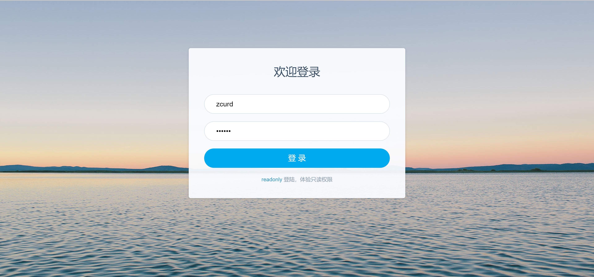

<h1 align="center">OA工作流管理系统</h1>

## 简介
OA工作流管理系统：通过绿色“WJC”标志和橙色背景结合的界面，体现Java编程的专业性和创新精神，适合Java开发者及相关团队。    --计算机毕业设计源码；毕设源码；java毕业设计源码

## 联系方式

<h3 align="center">获取完整代码与数据库文件 + 微信：bysj5151 QQ: 86050149 QQ群: 783742310</h3>

<h3 align="center">可帮忙远程部署 包运行成功！提供远程部署、修改代码、设计文档指导、代码讲解等服务！</h3>

## 功能介绍（完整见运行截图）
管理员：负责系统用户的管理，包括创建、修改和删除用户账户；监控和维护工作流的正常运行，处理异常事件和调度任务；配置和更新系统的各项参数，确保数据安全与系统稳定。  
经理：具有审批权限，负责审核和批准相关部门提交的申请和报告；监督项目进度和资源分配，优化工作流程，提高团队工作效率；生成各类报表并提出改进建议，确保部门目标的实现。  
员工：主要负责各类业务的提交和跟进；可以查看自己的待办事项，提交工作报告或申请，并追踪审批进度；能够参与项目协作，上传相关文档和资料，确保信息的有效传递。  
访客：无须注册即可查看系统的基本信息和公告，了解相关的操作指南和系统介绍；具有有限的访问权限，仅允许浏览对外开放的内容，确保信息的公开透明与易达性。

## 运行截图

本代码来源于网络,仅供学习参考使用!

